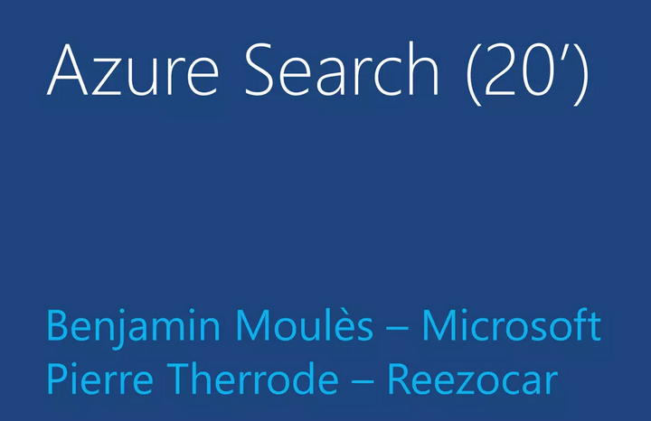

pyazuresearch
=============
small python SDK for Azure Search Preview.

Example use
-----------
Simple use-case::

    >>> from pyazuresearch import *

    #You need to specify the service name , the api version and your api-key
    >>> RZCAZ = AzureSearch(serviceName, apiversion, apiKey)

    # Create an index in Azure Search
    >>> createbody =  {
                        "name": createindex,  
                        "fields": [
                                        {"name": "ref", "type": "Edm.String", "key": True},
                                        {"name": "label", "type": "Edm.String" },
                                        {"name": "brand", "type": "Edm.String" },
                                        {"name": "model", "type": "Edm.String" },
                                        {"name": "mileage", "type": "Edm.Int32" },
                                        {"name": "title", "type": "Edm.String" },
                                        {"name": "description", "type": "Edm.String", "suggestions": True},
                                        {"name": "img_url", "type": "Edm.String", "searchable": False},
                                        {"name": "year", "type": "Edm.Int32" },
                                        {"name": "price", "type": "Edm.Int32" }]  
                     }
     >>> RZCAZ.createindex(indexname, createbody)

Links
-----------
About Azure Search: http://azure.microsoft.com/en-us/services/search/

Official documentation: http://azure.microsoft.com/en-us/documentation/services/search/

Azure Camp 9 Décembre - slides session- : http://fr.slideshare.net/Developpeurs/azure-camp-9-dcembre-slides-session-dveloppeurs-webmedia

About Reezocar: http://www.reezocar.com/
